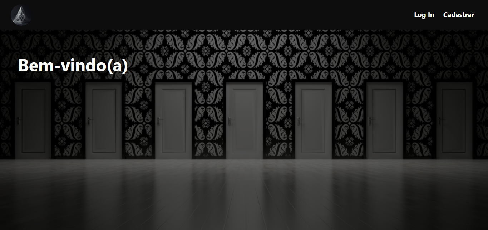
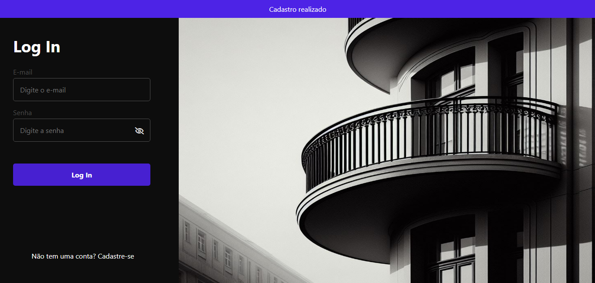
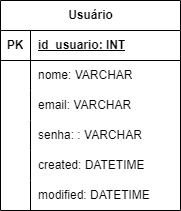

# Sistema Login e Cadastro

;
;
;

# Sobre o projeto 
É um projeto pessoal para aprendizado, com foco no uso de PHP juntamente com banco de dados SQL, usando princípios CRUD para criação de usuários e login de usuários. 

## Tecnologias utilizadas
PHP, MySQL, JavaScript, HTML, CSS, XAMPP.

No pacote XAMPP, foi utilizado o servidor web Apache e o sistema de gerenciamento de banco de dados MySQL.

## O projeto foi dividido em 7 arquivos:

- conexao.php responsável por criar a conexão com o SQL;
- processa.php responsável por fazer o processamento dos dados, tratamento de dados, previnindo SQL injections e limpando os campos recebidos, além de criptografar senhas. Também responsável por enviar dados para o banco de dados e fazer consultas, e envio de feedbacks para a interface;
- index.php onde é a Home da página;
- cadastro.php responsável pela interface para realizar o cadastro do usuário;
- login.php onde é a interface para realizar o login de usuário;
- script.js responsável pela interações do usuário com a interface;
- style.css com estilo do projeto;

## Modelo físico 
Modelo físico do banco de dados utilizado

